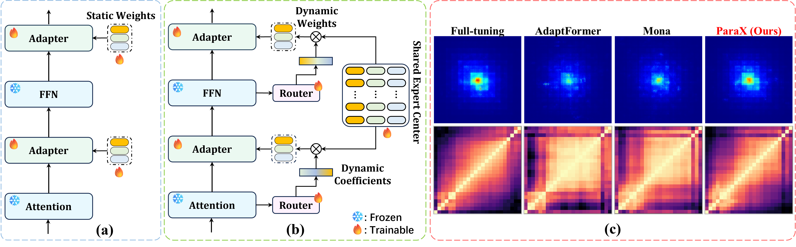
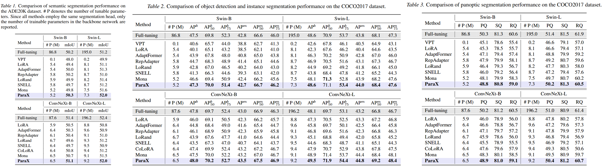

# [[ICML 2026] Parameters as Experts: Adapting Vision Models with Dynamic Parameter Routing](https://arxiv.org/abs/2602.06862)

This is an official PyTorch implementation of "[Parameters as Experts: Adapting Vision Models with Dynamic Parameter Routing](https://arxiv.org/abs/2602.06862)".

## Overview

Adapting pre-trained vision models using parameter-efficient fine-tuning (PEFT) remains challenging, as it aims to achieve performance comparable to full fine-tuning using a minimal number of trainable parameters. When applied to complex dense prediction tasks, existing methods exhibit limitations, including input-agnostic modeling and redundant cross-layer representations. To this end, we propose ParaX, a new adapter-style method featuring a simple mixture-of-experts (MoE) architecture. Specifically, we introduce shared expert centers, where each expert is a trainable parameter matrix. During a feedforward pass, each ParaX module in the network dynamically generates weight matrices tailored for the current module via a simple dynamic parameter routing mechanism, which selectively aggregates parameter matrices in the corresponding expert center. Dynamic weight matrices in ParaX modules facilitate low-rank adaptation in an input-dependent manner, thus generating more customized and powerful feature representations. Moreover, since ParaX modules across multiple network layers share the same expert center, they improve feature diversity by promoting implicit cross-layer feature interaction. Extensive experimental results demonstrate the superiority of ParaX across diverse visual recognition tasks.

<p align="center">
	
</p>
<p align="center">
	(a) Classical adapter-based PEFT methods. (b) Our proposed ParaX. (c) ERF and CKA comparisons of different methods.
</p>

<p align="center">
	
</p>
<p align="center">
	Results of diverse vision tasks.
</p>

## Experiments

### 1. Requirements

We highly suggest using our provided dependencies to ensure reproducibility:

```bash
# Environments:
cuda==12.1
python==3.12.4

# Packages:
pip install torch==2.2.2 torchvision==0.17.2 --index-url https://download.pytorch.org/whl/cu121
pip install timm==0.6.13
pip install mmcv-full==1.7.2 --no-cache-dir
pip install mmdet==2.28.2 --no-cache-dir
pip install mmsegmentation==0.30.0 --no-cache-dir
```

💡 To enable `torch>=2.1.0` to support `mmcv==1.7.2`, you need to make the following changes:

> 1. https://goo.su/XhU5vWr
> 2. https://goo.su/ogm4yO


### 2. Dataset Preparation

#### Dense Predictions

- ADE20K: [Guideline](https://github.com/open-mmlab/mmsegmentation/blob/main/docs/en/user_guides/2_dataset_prepare.md)
- COCO: [Guideline](https://github.com/open-mmlab/mmdetection/blob/2.x/docs/en/1_exist_data_model.md)


#### Image Classification

- ImageNet-R: [Download](https://drive.google.com/file/d/1SG4TbiL8_DooekztyCVK8mPmfhMo8fkR/view?usp=sharing)
- CIFAR-100, SVHN, and Food-101 are downloaded automatically on first use.


### 3. Pre-trained Weights

Please download the following pre-trained checkpoints before training.

| Models | Pre-trained Dataset | Download |
| :---: | :---: | :---: |
| Swin-B | ImageNet-22K | [Link](https://github.com/SwinTransformer/storage/releases/download/v1.0.0/swin_base_patch4_window7_224_22k.pth) |
| Swin-L | ImageNet-22K | [Link](https://github.com/SwinTransformer/storage/releases/download/v1.0.0/swin_large_patch4_window7_224_22k.pth) |
| ConvNeXt-B | ImageNet-22K | [Link](https://dl.fbaipublicfiles.com/convnext/convnext_base_22k_224.pth) |
| ConvNeXt-L | ImageNet-22K | [Link](https://dl.fbaipublicfiles.com/convnext/convnext_large_22k_224.pth) |
| ViT-B/16-MAE | ImageNet-1K | [Link](https://github.com/ShoufaChen/AdaptFormer/releases/download/v0.1/mae_pretrain_vit_b.pth) |

### 4. Training

This repository provides training recipes for ParaX with three representative vision backbones across diverse tasks: Swin, ConvNeXt, and ViT. We also provide a practical plug-and-play guide for integrating ParaX into your own model in [this document](models/parax_plug_and_play_guide.md).

#### Semantic Segmentation

To train Swin-B+ParaX+UperNet on ADE20K dataset with 4 GPUs (single node), run:

```bash
cd semantic_segmentation
NUM_GPUS=4
CONFIG=configs/ade20k/ade20k_upernet_swin_base_160k_parax.py
bash scripts/dist_train.sh $CONFIG $NUM_GPUS --work-dir work_dirs/ade20k/swin_b --batch-size 4
```

More Experimental Configs:

- `configs/ade20k/ade20k_upernet_swin_large_160k_parax.py`
- `configs/ade20k/ade20k_upernet_convnext_base_160k_parax.py`
- `configs/ade20k/ade20k_upernet_convnext_large_160k_parax.py`

Note: VMamba requires a newer ``mmcv`` version. Please use the [VMamba official repository](https://github.com/MzeroMiko/VMamba) together with [VMamba-ParaX](ParaX/models/vmamba_parax.py) for experiments.

#### Object Detection and Instance Segmentation

To train Swin-B+ParaX+Mask R-CNN on COCO dataset with 4 GPUs (single node), run:

```bash
cd object_detection
NUM_GPUS=4
CONFIG=configs/mask_rcnn/swin_b_mask_rcnn_1x_parax.py
bash scripts/dist_train.sh $CONFIG $NUM_GPUS --work-dir work_dirs/mask_rcnn/swin_b --batch-size 4
```

More Experimental Configs:

- `configs/mask_rcnn/swin_l_mask_rcnn_1x_parax.py`
- `configs/mask_rcnn/convnext_b_mask_rcnn_1x_parax.py`
- `configs/mask_rcnn/convnext_l_mask_rcnn_1x_parax.py`

#### Panoptic Segmentation

To train Swin-B+ParaX+Panoptic FPN on COCO dataset with 4 GPUs (single node), run:

```bash
cd object_detection
NUM_GPUS=4
CONFIG=configs/panoptic_fpn/panoptic_fpn_swin_b_fpn_1x_coco_parax.py
bash scripts/dist_train.sh $CONFIG $NUM_GPUS --work-dir work_dirs/panoptic_fpn/swin_b --batch-size 4
```

More Experimental Configs:

- `configs/panoptic_fpn/panoptic_fpn_swin_l_fpn_1x_coco_parax.py`
- `configs/panoptic_fpn/panoptic_fpn_convnext_b_fpn_1x_coco_parax.py`
- `configs/panoptic_fpn/panoptic_fpn_convnext_l_fpn_1x_coco_parax.py`

#### Image Classification

To train ViT-B/16+ParaX on ImageNet-R dataset with 4 GPUs (single node), run:

```bash
cd image_classification
export PRETRAINED=/path/to/mae_pretrain_vit_b.pth
export CLS_DATA_ROOT=/path/to/data
NUM_GPUS=4 bash scripts/train_imagenet_r.sh
```

More Launchers:

- `NUM_GPUS=4 bash scripts/train_cifar100.sh`
- `NUM_GPUS=4 bash scripts/train_svhn.sh`
- `NUM_GPUS=4 bash scripts/train_food101.sh`

## Citation

If you find this project useful for your research, please consider citing:

```bibtex
@inproceedings{lou2026parametersasexperts,
	title={Parameters as Experts: Adapting Vision Models with Dynamic Parameter Routing},
	author={Lou, Meng and Yu, Stanley and Yu, Yizhou},
	booktitle={International Conference on Machine Learning},
	year={2026}
}
```

## Acknowledgments

We would like to thank the following repositories for providing valuable components and resources that supported this project:   
[MMCV](https://github.com/open-mmlab/mmcv), [MMDet](https://github.com/open-mmlab/mmdetection), [MMSeg](https://github.com/open-mmlab/mmsegmentation), [Mona](https://github.com/leiyi-hu/mona), [AdaptFormer](https://github.com/ShoufaChen/AdaptFormer), [Swin](https://github.com/microsoft/Swin-Transformer), [ConvNext](https://github.com/facebookresearch/ConvNeXt), [VMamba](https://github.com/MzeroMiko/VMamba)

## Contact
If you have any questions, please feel free to create an issue or contact me at ``lmzmm.0921@gmail.com``.
